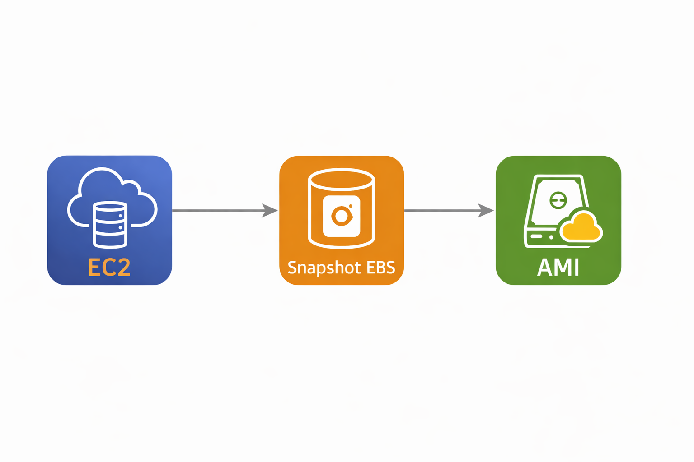

# 🚀 Gerenciando Instâncias EC2 na AWS

## 📋 Descrição do Desafio
Este projeto faz parte do laboratório da plataforma DIO e tem como objetivo consolidar conhecimentos fundamentais sobre **instâncias EC2**, **Amazon Machine Images (AMI)** e **Snapshots EBS**.  
A entrega consiste em um repositório público com documentação clara e estruturada, demonstrando compreensão dos conceitos abordados.

---

## 🎯 Objetivos de Aprendizagem
- Aplicar conceitos de EC2 em um ambiente prático.  
- Documentar processos técnicos de forma clara e organizada.  
- Utilizar o GitHub como ferramenta de compartilhamento de documentação técnica.  

---

## 🧩 Passo a Passo do Projeto
1. Criação da Instância EC2  
2. Criação de Snapshot EBS  
3. Criação de AMI  

---

## 🏗️ Arquitetura do Projeto
A arquitetura segue um fluxo simples e direto:

1. **[EC2](ca://s?q=O_que_e_AWS_EC2)** → Criação da instância.  
2. **[Snapshot EBS](ca://s?q=O_que_e_um_Snapshot_EBS)** → Backup incremental do volume.  
3. **[AMI](ca://s?q=O_que_e_uma_AMI_AWS)** → Imagem personalizada para replicação.  

### Fluxo EC2 → Snapshot → AMI


---

## 📁 Estrutura do Repositório
```text
dio-aws-ec2-management
├── README.md
├── anotacoes.md
└── imagens
````

---

---

## 📈 Próximos Passos
Este projeto cobre os fundamentos de **EC2**, **Snapshots EBS** e **AMIs**.  
Como evolução, você pode explorar:

- **[Auto Scaling](ca://s?q=O_que_e_Auto_Scaling_AWS)** → Ajuste automático da quantidade de instâncias conforme a demanda.  
- **[Elastic Load Balancer](ca://s?q=O_que_e_Elastic_Load_Balancer)** → Distribuição inteligente de tráfego entre múltiplas instâncias.  
- **[CloudWatch](ca://s?q=O_que_e_AWS_CloudWatch)** → Monitoramento de métricas, logs e alertas para manter a saúde da infraestrutura.  
- **[IAM](ca://s?q=O_que_e_AWS_IAM)** → Controle de acesso e segurança com usuários, grupos e políticas.  
- **[S3](ca://s?q=O_que_e_AWS_S3)** → Armazenamento escalável para backups e dados persistentes.  

Esses recursos permitem construir ambientes mais **resilientes, escaláveis e seguros**, aproximando-se de arquiteturas profissionais utilizadas em produção.

---

## 🏁 Conclusão
Este projeto reforça a importância de dominar conceitos básicos de **[EC2](ca://s?q=O_que_e_AWS_EC2)**, **[Snapshots EBS](ca://s?q=O_que_e_um_Snapshot_EBS)** e **[AMIs](ca://s?q=O_que_e_uma_AMI_AWS)** para construir ambientes escaláveis, seguros e replicáveis na nuvem AWS.  

A documentação clara, os comandos simulados e o diagrama visual tornam este repositório um material de apoio útil para estudos e futuras implementações em **computação em nuvem**.  
Com os **Próximos Passos** sugeridos, o projeto pode evoluir para arquiteturas mais robustas, incluindo **[Auto Scaling](ca://s?q=O_que_e_Auto_Scaling_AWS)**, **[Elastic Load Balancer](ca://s?q=O_que_e_Elastic_Load_Balancer)** e **[CloudWatch](ca://s?q=O_que_e_AWS_CloudWatch)**.


